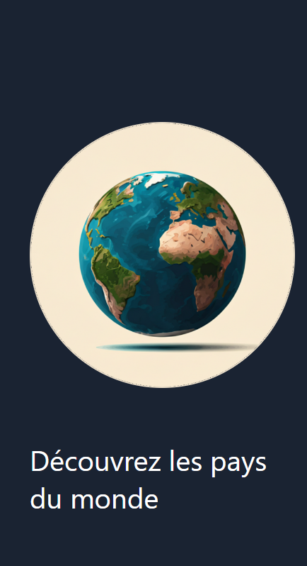
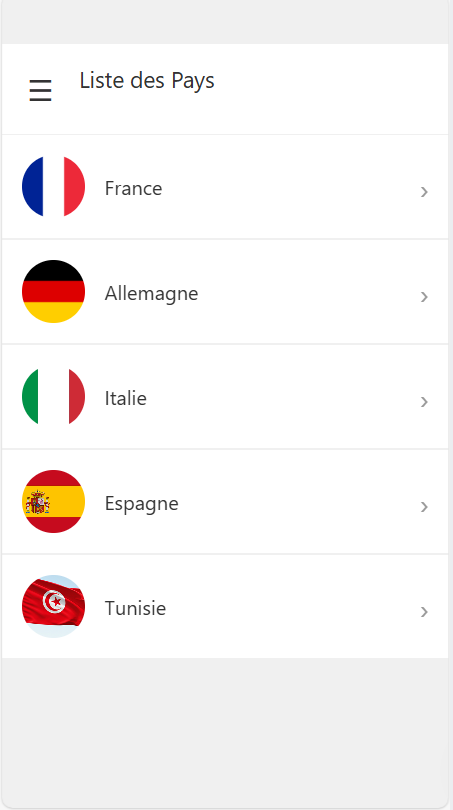
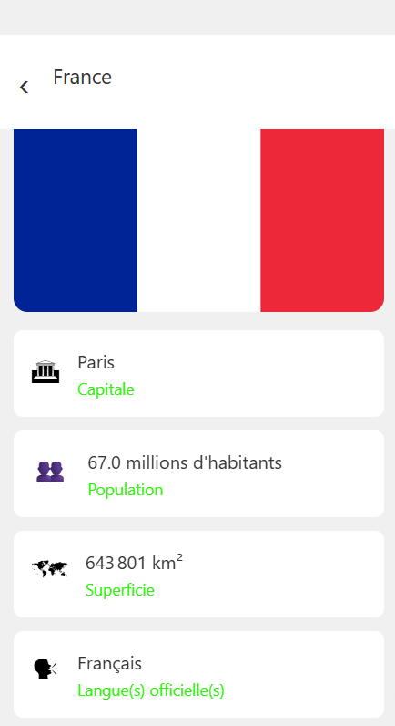
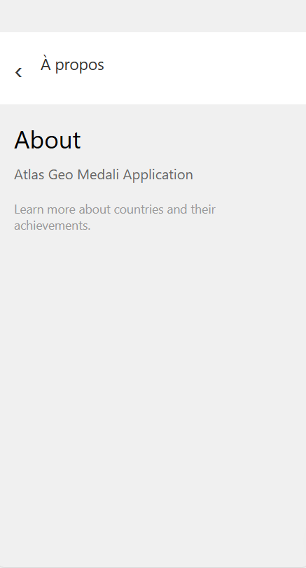

# Atlas Géographique Medali

Une application mobile interactive pour découvrir les pays du monde avec leurs informations détaillées.

## 📸 Captures d'Écran

<div align="center">
  
  
  
  
  
</div>

### Description des Écrans

- **Écran d'accueil** : Page de bienvenue avec globe et bouton "Explorer"
- **Liste des pays** : Affichage de tous les pays avec drapeaux circulaires et navigation drawer
- **Détails du pays** : Informations complètes avec drapeau, capitale, population, superficie et langue
- **Menu drawer** : Navigation latérale avec accès à toutes les sections
- **À propos** : Informations sur l'application

## 📱 Fonctionnalités

- **Page d'accueil** : Écran de bienvenue avec un globe et un bouton pour explorer
- **Liste des pays** : Affichage de tous les pays avec leurs drapeaux
- **Détails des pays** : Informations complètes (capitale, population, superficie, langue)
- **Navigation drawer** : Menu latéral pour naviguer entre les pages
- **À propos** : Informations sur l'application

## 🛠️ Technologies Utilisées

- **React Native** avec Expo SDK 54
- **TypeScript** pour la sécurité des types
- **React Navigation v7** (Stack & Drawer)
- **React Native Reanimated** pour les animations

## 📦 Installation

1. Cloner le repository :
```bash
git clone <your-repo-url>
cd atlas_geo_medali
```

2. Installer les dépendances :
```bash
npm install
```

3. Lancer l'application :
```bash
npx expo start
```

4. Scanner le QR code avec Expo Go (iOS/Android)

## 📂 Structure du Projet

```
atlas_geo_medali/
├── app/
│   ├── WelcomePage.tsx      # Page d'accueil
│   ├── CountriesPage.tsx    # Liste des pays
│   ├── CountryDetailPage.tsx # Détails d'un pays
│   └── AboutPage.tsx         # À propos
├── data/
│   └── countriesData.ts      # Données des pays
├── assets/
│   └── flags/                # Drapeaux des pays
├── App.tsx                   # Configuration de navigation
└── package.json
```

## 🌍 Pays Disponibles

- 🇫🇷 France
- 🇩🇪 Allemagne
- 🇮🇹 Italie
- 🇪🇸 Espagne
- 🇹🇳 Tunisie

## 🚀 Utilisation

1. **Explorer** : Tapez sur "Explorer" depuis l'écran d'accueil
2. **Sélectionner un pays** : Tapez sur un pays dans la liste
3. **Voir les détails** : Consultez les informations complètes du pays
4. **Menu** : Utilisez l'icône ☰ pour ouvrir le menu latéral
5. **Quitter** : Retournez à l'écran d'accueil via le menu

## 📝 Informations Affichées

Pour chaque pays :
- 🏛️ **Capitale**
- 👥 **Population** (en millions d'habitants)
- 🗺️ **Superficie** (en km²)
- 🗣️ **Langue(s) officielle(s)**

## 🎨 Design

- Interface sombre pour l'écran d'accueil
- Cartes avec icônes pour les informations
- Drapeaux circulaires dans la liste
- Navigation intuitive avec retour arrière

## 📱 Compatibilité

- ✅ iOS (via Expo Go)
- ✅ Android (via Expo Go)
- ✅ Web

## 👨‍💻 Développeur

Développé par Dali

## 📄 Licence

MIT License
